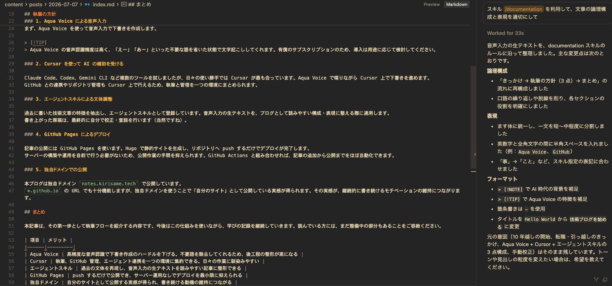

+++
date = '2026-07-07T22:54:36+09:00'
draft = false
title = '技術ブログを始めることにした'
+++

大学卒業から 10 年以上が経ち、ようやく技術ブログを書き始めることにしました。10 年前から「いつか書こう」と思い続けていましたが、ついぞ手が伸びない日々が続いていました。

## きっかけ

今回、転職に伴い岡山県から愛知県へ引っ越しました。このタイミングを機に、学んだことを記録する場としてブログを立ち上げます。

> [!NOTE]
> AI の普及により、人間が書く文章の価値がどこまで残るかは分かりません。ただし、自分の中で噛み砕いて理解できたことを、未来の自分のために残しておきたいと考えています。

記載する内容は技術に限定しません。日常の中で学んだことも、必要に応じて書いていきます。

## 執筆の方針

毎日更新は現実的ではないため、できるだけ手離れする執筆フローを用意しました。大きく次の 5 点です。

### 1. Aqua Voice による音声入力

まず、Aqua Voice を使って音声入力で下書きを作成します。

> [!TIP]
> Aqua Voice の音声認識精度は高く、「えー」「あー」といった不要な語を省いた状態で文字起こししてくれます。有償のサブスクリプションのため、導入は用途に応じて検討してください。

### 2. Cursor を使って AI の補助を受ける

Claude Code、Codex、Gemini CLI など複数のツールを試しましたが、日々の使い勝手では Cursor が最も合っています。Aqua Voice で喋りながら Cursor 上で下書きを進めます。
GitHub との連携やリポジトリ管理も Cursor 上で行えるため、執筆と管理を一つの環境にまとめられます。

### 3. エージェントスキルによる文体調整

過去に書いた技術文章の特徴を抽出し、エージェントスキルとして登録しています。音声入力の生テキストを、ブログとして読みやすい構成・表現に整える際に適用します。
書き上がった原稿は、最終的に自分で校正・査読を行います（当然ですね）。

### 4. GitHub Pages によるデプロイ

記事の公開には GitHub Pages を使います。Hugo で静的サイトを生成し、リポジトリへ push するだけでデプロイが完了します。
サーバーの構築や運用を自前で行う必要がないため、公開作業の手間を抑えられます。GitHub Actions と組み合わせれば、記事の追加から公開までをほぼ自動化できます。

### 5. 独自ドメインでの公開

本ブログは独自ドメイン `notes.kirisame.tech` で公開しています。
`*.github.io` の URL でも十分機能しますが、独自ドメインを使うことで「自分のサイト」として公開している実感が得られます。その実感が、継続的に書き続けるモチベーションの維持につながります。

## まとめ

本記事は、その第一歩として執筆フローを紹介する内容です。今後はこの仕組みを使いながら、学びの記録を継続していきます。読んでいる方には、まだ整備中の部分もあることをご容赦ください。

| 項目 | メリット |
|------|---------|
| Aqua Voice | 高精度な音声認識で下書き作成のハードルを下げる。不要語を除去してくれるため、後工程の整形が楽になる |
| Cursor | 執筆、GitHub 管理、エージェント連携を一つの環境に集約できる。日々の作業に馴染みやすい |
| Agent Skills | 過去の文体を再現し、音声入力の生テキストを読みやすい記事に整形できる |
| GitHub Pages | push するだけで公開でき、サーバー運用なしでデプロイを最小限に抑えられる |
| 独自ドメイン | 自分のサイトとして公開する実感が得られ、書き続ける動機の維持につながる |

|  | |
|----------------------------|-------------------------|
| これをこうして | こうじゃ |

以上が、本ブログの執筆方針です。
設定やテーマも、色々いじって楽しみつつ書けると良いな。
